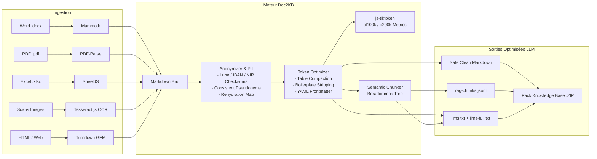

<div align="center">

# 🧠 Doc2KB Studio v2.0

### **Universal Document to AI Knowledge Base Studio & LLM Token Reduction Engine**

*Transformez vos documents d'entreprise (Word, PDF, Excel, Scans OCR, HTML, Code) en bases de connaissances haute fidélité pour LLMs, conformes à la norme **llms.txt** et taillées pour le RAG vectoriel avec une réduction drastique de tokens (-30% à -60%).*

---

[](https://nodejs.org)
[](https://github.com/kimitoshikurosawa/doc2kb-studio/actions)
[](https://llmstxt.org)
[-orange.svg?style=flat-square)](lib/tokenizer.js)
[](server.js)
[](LICENSE)

[Fonctionnalités](#-fonctionnalités-clés) •
[Pourquoi ce projet ?](#-le-problème-résolu-finops-ia--rag) •
[Benchmark Tokens](#-benchmark--réduction-de-tokens) •
[Guides Techniques (docs/)](docs/) •
[Démarrage Rapide](#-démarrage-rapide) •
[API REST](#-documentation-des-endpoints-api) •
[Usage Bibliothèque](#-usage-programmatique-sdk--lib) •
[Architecture](#-architecture-technique)

</div>

---

## 💥 Le Problème Résolu (FinOps IA & RAG)

Lorsque les entreprises déploient des pipelines RAG (*Retrieval-Augmented Generation*) ou alimentent des LLMs (*GPT-4o, Claude 3.5 Sonnet, Gemini 1.5, Llama 3*), elles rencontrent trois goulets d'étranglement majeurs :

1. **La Facture d'API Infernale & Saturation de Contexte** :
   Les formats bruts (DOCX avec XML invisible, PDF avec en-têtes répétés, tables Excel avec padding blanc) injectent des dizaines de milliers de tokens inutiles. Le coût de traitement s'envole et le modèle s'égare (*Lost in the Middle*).
2. **Le Découpage Naïf qui Détruit le Sens** :
   Découper arbitrairement un texte tous les 500 ou 1 000 caractères brise les phrases, les cellules de tableaux et les blocs de code. Le vecteur généré dans la base vectorielle perd tout son contexte d'origine.
3. **L'Absence de Standard pour Agents Autonomes** :
   Les agents (Cursor, Claude Code, Copilot, LangChain) naviguent à l'aveugle sans index structuré.

**Doc2KB Studio** résout ces trois défis avec un moteur local et en mémoire tampon, garantissant **zéro fuite de données confidentielles**, une **réduction de 30% à 60% des tokens** et une compatibilité directe avec la norme émergente **[llms.txt](https://llmstxt.org/)**.

---

## ✨ Fonctionnalités Clés

### 📄 1. Ingestion Multi-Formats Universelle (Zero-Cloud Leak)
* **Word (.docx, .doc)** : Conversion Mammoth épurée vers ATX Markdown.
* **PDF (.pdf)** : Extraction de texte avancée avec classification intelligente des titres (`H1`, `H2`, `H3`), suppression automatique des mentions de pagination récurrentes (`Page 1 of 12`) et recollement des phrases césurées.
* **Excel & Tableurs (.xlsx, .xls, .csv)** :
  * **Mode Compact GFM** : Suppression des espaces superflus dans chaque cellule de tableau (`|ColA|ColB|`).
  * **Mode Records (Clé-Valeur)** : Reformatage sous forme d'attributs sémantiques, réduisant la consommation de tokens de plus de 50% sur les grands jeux de données.
  * **Protection Contexte** : Tronquage contrôlé avec warning en cas de tables géantes pour préserver le budget tokens.
* **OCR Images & Photos (.png, .jpg, .jpeg, .webp, .bmp)** : Reconnaissance optique de caractères locale via Tesseract.js (support bilingue français et anglais).
* **HTML & Pages Web** : Nettoyage des balises scripts/navigation et conversion propre via Turndown GFM.
* **Code & Données (.json, .js, .py, .sql, .yaml, .rtf)** : Encapsulation dans des blocs de code typés avec coloration syntaxique.

---

### ⚡ 2. Moteur de Réduction de Tokens & Compaction
Trois profils d'optimisation sélectionnables :
* 🌿 **Raw (Standard)** : Balisage pur sans altération.
* ⚡ **Clean (Optimisé LLM)** *(Recommandé)* : Élagage des balises HTML vides, suppression du boilerplate documentaire, normalisation des sauts de ligne (**-15% à -25% de tokens**).
* 🚀 **Ultra-Compact (Token Saver Max)** : Compression chirurgicale des tables GFM, condensation des listes, nettoyage des paramètres de tracking dans les URLs (`utm_*`) (**-30% à -50% de tokens** sans altération des faits).
* 🏷️ **Frontmatter YAML Automatique** : Génération et injection des métadonnées (titre, résumé, mots-clés, tokens estimés, arborescence des sections).

---

### 🧩 3. Découpage Sémantique RAG & Export JSONL
* **Respect de l'Arborescence** : Les sections sont isolées selon leurs délimiteurs sémantiques (`H1`, `H2`, `H3`).
* **Fil d'Ariane Contextuel (`Breadcrumbs`)** : Chaque chunk embarque son chemin hiérarchique complet (ex: `Architecture > Sécurité > Chiffrement`). Lors de la recherche vectorielle, le LLM comprend immédiatement la provenance exacte du snippet.
* **Format Prêt à l'Emploi** : Export en **`.jsonl`** compatible avec **Pinecone, ChromaDB, Qdrant, Weaviate, Milvus, LangChain et LlamaIndex**.

---

### 📑 4. Norme Standard `llms.txt` (llmstxt.org)
Génération automatique en 1 clic d'un pack complet d'archive `.zip` contenant :
* `llms.txt` : Index synthétique annoté avec descriptions et poids en tokens.
* `llms-full.txt` : Corpus exhaustif optimisé pour les modèles à fenêtre large (*Gemini 1.5 Pro, Claude 3.5 Sonnet*).
* `llms-small.txt` : Résumé exécutif des concepts et sections clés.
* `rag-chunks.jsonl` : Chunks vectoriels découpés et typés.
* `manifest.json` : Métriques consolidées, bilan d'économie et horodatage.
* `docs/*.md` : Tous les documents individuels au format Markdown optimisé.

---

### 📊 5. Métrologie Précise & Calculateur de Coûts API
* Encodages BPE réels via **`js-tiktoken`** (`cl100k_base` pour GPT-4 & Claude, `o200k_base` pour GPT-4o).
* Tableau de bord en direct affichant les coûts estimés par requête pour :
  * **OpenAI GPT-4o** ($2.50 / 1M input)
  * **Anthropic Claude 3.5 Sonnet** ($3.00 / 1M input)
  * **Google Gemini 1.5 Flash** ($0.075 / 1M input)
  * **OpenAI GPT-4o Mini** ($0.15 / 1M input)

---

### 🛡️ 6. Anonymisation & Pseudonymisation Locale (RGPD / Safe RAG)
* **100% In-Memory (Zero Data Leak)** : Zéro envoi de données sensibles vers des clouds tiers, conformité RGPD (Art. 5, 25, 32), HIPAA et PCI-DSS.
* **Validation Mathématique Formelle (Checksums)** :
  * **Cartes bancaires** validées par l'algorithme de **Luhn** (ISO/IEC 7812).
  * **Comptes IBAN** validés par **ISO 7064 Modulo 97-10**.
  * **Numéros de Sécurité Sociale Français (NIR)** validés par clé **Modulo 97**.
* **Protection des Secrets DevOps** : Neutralisation chirurgicale des clés OpenAI (`sk-...`, `sk-proj-...`), identifiants AWS IAM (`AKIA...`), GitHub PAT, tokens JWT et clés privées PEM.
* **Pseudonymisation Cohérente** : Substitution d'alias stables (`[PERSONNE_1]`, `[EMAIL_1]`) préservant la co-référence et la logique relationnelle pour les LLMs, avec génération locale d'une table de réhydratation (*detokenization*).

---

## 📈 Benchmark & Réduction de Tokens

Tests réels mesurés avec l'encodage BPE `cl100k_base` :

| Document Source | Format Initial | Tokens Bruts | Tokens Doc2KB (Ultra-Compact) | Tokens Économisés | Réduction (%) |
| :--- | :--- | :---: | :---: | :---: | :---: |
| **Contrat d'Entreprise** | .DOCX (28 pages) | 14 250 | 9 120 | **- 5 130** | **- 36.0%** |
| **Bilan Financier & Ventes** | .XLSX (1 200 lignes) | 18 600 | 8 950 | **- 9 650** | **- 51.8%** |
| **Documentation API & Guide** | .HTML (Web scrapé) | 8 400 | 3 150 | **- 5 250** | **- 62.5%** |
| **Manuel Technique Scanné** | .PDF + Images OCR | 6 800 | 4 480 | **- 2 320** | **- 34.1%** |

---

## 🏗️ Architecture du Pipeline



---

## 📚 Guides & Bonnes Pratiques Détaillées (`docs/`)

Pour approfondir les concepts d'architecture et les implémentations en production, consultez nos guides complets :

* 💰 **[Guide de l'Économie de Tokens & FinOps IA](docs/01-token-economy-guide.md)** : Fonctionnement de BPE, Prompt Caching à -90%, minification des tables et étude de ROI.
* 🧩 **[Guide des Meilleures Pratiques RAG & Découpage Sémantique](docs/02-rag-best-practices.md)** : Chunking structure-aware, injection de `breadcrumbs`, formats JSONL et architecture en 2 étapes.
* 📑 **[Spécification & Implémentation de la Norme llms.txt](docs/03-llms-txt-standard.md)** : Norme Answer.AI, anatomie d'un index IA et optimisation GEO (*Generative Engine Optimization*).
* 🛠️ **[Guide d'Intégration Technique & Déploiement Production](docs/04-integration-and-deployment.md)** : Déploiement Docker, API REST en Python/Node.js et sécurité in-memory (RGPD).
* 🛡️ **[Guide de l'Anonymisation des Données & Protection de la Vie Privée](docs/05-data-anonymization-and-privacy.md)** : Conformité RGPD/HIPAA/PCI-DSS, validation par checksums (Luhn, IBAN, NIR) et pseudonymisation cohérente pour RAG.

---

## 🚀 Démarrage Rapide

### Prérequis
* **Node.js** version 20.x ou 24.x LTS (compatible nvm `nvm use 24`)
* **npm** version 10.x ou 11.x

### Installation

```bash
# 1. Cloner le dépôt
git clone https://github.com/kimitoshikurosawa/doc2kb-studio.git
cd doc2kb-studio

# 2. Installer les dépendances
npm install

# 3. Lancer la suite de tests unitaires
npm test

# 4. Démarrer le serveur
npm start
```

Ouvrez ensuite votre navigateur sur :
👉 **`http://localhost:3000`**

---

## 📡 Documentation des Endpoints API

### 1. Ingestion et Conversion d'un Fichier Unique
`POST /api/convert` (Multipart/form-data)

**Paramètres du formulaire :**
* `file` : Le fichier à convertir (.docx, .pdf, .xlsx, .png, .html, etc.)
* `level` : `'clean'` *(défaut)* | `'ultra_compact'` | `'raw'`
* `injectFrontmatter` : `'true'` *(défaut)* | `'false'`
* `includeRag` : `'true'` *(défaut)* | `'false'`
* `chunkMaxTokens` : `600` *(défaut, nombre entier)*
* `anonymize` : `'true'` | `'false'` *(défaut)* — Active la détection et neutralisation PII
* `anonymizeMode` : `'pseudonymize'` *(défaut)* | `'mask'` | `'redact'`

**Exemple cURL :**
```bash
curl -X POST http://localhost:3000/api/convert \
  -F "file=@mon-rapport.docx" \
  -F "level=ultra_compact" \
  -F "injectFrontmatter=true" \
  -F "includeRag=true" \
  -F "anonymize=true" \
  -F "anonymizeMode=pseudonymize"
```

**Réponse JSON :**
```json
{
  "success": true,
  "result": {
    "originalFilename": "mon-rapport.docx",
    "outputFilename": "mon-rapport.md",
    "markdown": "---\ntitle: \"Rapport Trimestriel\"\ntokens: 420\n---\n\n# Rapport Trimestriel...",
    "stats": {
      "tokens": 420,
      "cl100kTokens": 420,
      "o200kTokens": 412,
      "words": 280,
      "tokensPerWord": 1.5,
      "estimatedCosts": { "gpt4o": 0.00105, "claude35Sonnet": 0.00126 }
    },
    "savings": {
      "originalTokens": 630,
      "optimizedTokens": 420,
      "tokensSaved": 210,
      "savingsPercentage": 33.3
    },
    "anonymization": {
      "entitiesCount": 3,
      "stats": { "total": 3, "byType": { "person_name": 1, "email": 1, "iban": 1 } },
      "rehydrationMap": { "[PERSONNE_1]": "Jean Dupont", "[EMAIL_1]": "jean.dupont@test.com" }
    },
    "rag": {
      "totalChunks": 3,
      "totalTokens": 420,
      "chunks": [
        {
          "id": "mon-rapport_chunk_1",
          "title": "Introduction",
          "breadcrumbsStr": "Rapport Trimestriel > Introduction",
          "tokenCount": 140,
          "content": "## Introduction\n..."
        }
      ]
    }
  }
}
```

---

### 2. Optimisation Directe de Texte / Markdown à la Volée
`POST /api/optimize-text` (Application/json)

Idéal pour compresser un prompt ou du texte copié-collé avant envoi vers un LLM.

```bash
curl -X POST http://localhost:3000/api/optimize-text \
  -H "Content-Type: application/json" \
  -d '{
    "text": "# Titre\n\n| Col A      | Col B      |\n| ---------- | ---------- |\n| Val 1      | Val 2      |\n\n\n- point 1\n\n- point 2",
    "level": "ultra_compact",
    "includeRag": true
  }'
```

---

### 3. Compilation et Téléchargement du Pack Base de Connaissances (.ZIP)
`POST /api/generate-knowledge-base` (Application/json)

Génère une archive ZIP complète comprenant `llms.txt`, `llms-full.txt`, `llms-small.txt`, `rag-chunks.jsonl` et les documents `.md`.

```bash
curl -X POST http://localhost:3000/api/generate-knowledge-base \
  -H "Content-Type: application/json" \
  -d '{
    "projectTitle": "Documentation Technique Projet X",
    "level": "ultra_compact",
    "documents": [
      { "filename": "architecture.md", "markdown": "# Architecture\n\nContenu..." },
      { "filename": "securite.md", "markdown": "# Sécurité\n\nDirectives..." }
    ]
  }' --output knowledge-base.zip
```

---

### 4. Export Exclusif des Chunks RAG en JSONL
`POST /api/export-rag-jsonl` (Application/json)

Retourne directement un flux `application/x-ndjson` prêt à charger dans un vector store.

```bash
curl -X POST http://localhost:3000/api/export-rag-jsonl \
  -H "Content-Type: application/json" \
  -d '{"chunks": [{"id": "chunk_1", "docTitle": "Guide", "title": "Sec 1", "content": "Texte..."}]}' \
  --output rag-chunks.jsonl
```

---

### 5. Health Check & Capacités Actives
`GET /api/status`

```bash
curl http://localhost:3000/api/status
```

---

## 💻 Usage Programmatique (SDK / Node.js)

Vous pouvez réutiliser directement les modules de `lib/` dans vos propres scripts backend ou microservices :

```javascript
const fs = require('fs');
const { convertFileToMarkdown } = require('./lib/converter');
const { optimizeMarkdown } = require('./lib/tokenOptimizer');
const { chunkMarkdownForRag } = require('./lib/semanticChunker');
const { generateLlmsTxt } = require('./lib/llmsTxtGenerator');

async function main() {
  // 1. Conversion d'un fichier Word / PDF / Excel
  const buffer = fs.readFileSync('contrat.docx');
  const result = await convertFileToMarkdown(buffer, 'contrat.docx', 'application/vnd.openxmlformats-officedocument.wordprocessingml.document', {
    level: 'ultra_compact',
    injectFrontmatter: true,
    includeRag: true,
    chunkMaxTokens: 500
  });

  console.log(`Tokens avant : ${result.savings.originalTokens}`);
  console.log(`Tokens après : ${result.savings.optimizedTokens}`);
  console.log(`Économie : -${result.savings.savingsPercentage}%`);

  // 2. Export des Chunks pour Base Vectorielle (Pinecone, Chroma...)
  const jsonlData = result.rag.jsonl;
  fs.writeFileSync('contrat-chunks.jsonl', jsonlData);

  // 3. Génération du standard llms.txt
  const llmsTxt = generateLlmsTxt([{
    filename: result.outputFilename,
    markdown: result.markdown,
    title: result.meta.title
  }], { projectTitle: 'Base Contrats' });

  fs.writeFileSync('llms.txt', llmsTxt);
}

main();
```

---

## 📁 Arborescence du Projet

```
doc2kb-studio/
├── server.js                 # API REST Express & orchestration des flux
├── package.json              # Dépendances & scripts de démarrage
├── test-converters.js        # Suite de tests automatisés (8 tests end-to-end)
├── README.md                 # Documentation d'architecture complète
├── eng.traineddata           # Données de langue anglaise pour OCR Tesseract
├── fra.traineddata           # Données de langue française pour OCR Tesseract
├── lib/
│   ├── tokenizer.js          # Calcul BPE (cl100k, o200k) & analyse de coûts
│   ├── tokenOptimizer.js     # Compaction tables, nettoyage boilerplate & frontmatter
│   ├── semanticChunker.js    # Découpage sémantique RAG & génération JSONL
│   ├── llmsTxtGenerator.js   # Générateur llms.txt, llms-full.txt & llms-small.txt
│   ├── knowledgeBaseService.js# Service d'assemblage et de packaging ZIP
│   ├── converter.js          # Pipeline unifié et moteur markdown-it
│   ├── docxConverter.js      # Parser Mammoth (DOCX vers Markdown)
│   ├── pdfConverter.js       # Parser PDF avec détection ATX et nettoyage césures
│   ├── excelConverter.js     # Parser Tableurs avec modes compact & records
│   ├── htmlConverter.js      # Nettoyage et conversion HTML Turndown GFM
│   ├── ocrConverter.js       # OCR local Tesseract.js (PNG, JPG, WEBP)
│   └── textConverter.js      # Parser Code source, JSON et texte brut
└── public/
    ├── index.html            # Interface Web Studio (Rendu live, RAG & Stats)
    ├── css/style.css         # Design system sombre/clair avec glassmorphism
    └── js/
        ├── app.js            # Client réactif, drag & drop, synchronisation live
        └── markdown-it.min.js# Bibliothèque cliente de rendu Markdown
```

---

## 🧪 Exécution des Tests

Le projet inclut une suite de tests unitaires et d'intégration validant l'ensemble de la chaîne de traitement :

```bash
npm test
```

**Sortie attendue :**
```text
🧪 Lancement de la suite de tests complète Doc2KB Studio...

✅ 1. Test HTML -> Markdown OK
✅ 2. Test Excel -> Compact Markdown Table OK
✅ 3. Test Tokenizer js-tiktoken OK: 27 tokens (cl100k), coût estimé GPT-4o: $0.000068
✅ 4. Test Optimiseur de Tokens OK: 4 tokens économisés (9.3%)
✅ 5. Test Découpage RAG sémantique OK: 5 chunks créés avec breadcrumbs hiérarchiques
✅ 6. Test Norme llms.txt OK (conforme llmstxt.org)
✅ 7. Test Pack Base de Connaissances complet OK: 2 docs, 138 tokens totaux
✅ 8. Test Pipeline convertFileToMarkdown complet OK (Tokens: 37)
✅ 9. Test Moteur Anonymisation & Pseudonymisation OK: 10 entités détectées (Luhn, IBAN, NIR, Emails, Clés API, Cohérence d'alias)
✅ 10. Test Pipeline complet avec Anonymisation Safe RAG OK (4 entités neutralisées, Zero Data Leak)

🎉 TOUS LES TESTS (10/10) SONT PASSÉS AVEC SUCCÈS !
```

---

## 🗺️ Roadmap & Évolutions Futures

- [ ] **Connecteurs Directs Vector DB** : Push en 1 clic vers Pinecone, Qdrant et Chroma via clés API configurables.
- [ ] **Embeddings Locaux Intégrés** : Calcul direct des embeddings vectoriels via `xenova/transformers` (ex: `bge-small-en-v1.5` ou `all-MiniLM-L6-v2`) sans dépendance cloud.
- [ ] **Image Docker Officielle** : Image Alpine légère prête pour Kubernetes et déploiement on-premise.
- [ ] **GitHub Action CI/CD** : Automatisation de la génération de `llms.txt` à chaque push sur un dépôt de documentation.
- [ ] **Middleware Reverse Proxy** : Proxy LLM interceptant les payloads entrants pour compresser automatiquement les documents joints avant envoi à l'API OpenAI / Anthropic.

---

## 🤝 Contribution

Les contributions de la communauté sont les bienvenues !
1. Forkez le projet.
2. Créez votre branche de fonctionnalité (`git checkout -b feature/nouvelle-fonctionnalite`).
3. Assurez-vous que tous les tests passent (`npm test`).
4. Committez vos modifications (`git commit -m 'feat: ajout support format epub'`).
5. Pushez sur votre branche (`git push origin feature/nouvelle-fonctionnalite`).
6. Ouvrez une **Pull Request**.

---

## 💼 Conseil, Intégration Entreprise & Support

Vous souhaitez déployer **Doc2KB Studio** sur votre infrastructure souveraine, l'intégrer à votre pipeline RAG existant ou auditer vos coûts de tokens LLM ?

* **Consulting & Intégration RAG sur mesure** : Architecture de données non structurées, Fine-Tuning & FinOps IA.
* **Licence Entreprise & SLA** : Support dédié, connecteurs sécurisés S3/SharePoint et conformité RGPD / HIPAA.

> Pour toute demande professionnelle ou opportunité de partenariat, ouvrez une discussion ou contactez l'équipe via GitHub.

---

## 📄 Licence

Ce projet est distribué sous licence libre **MIT**. Vous êtes libre de l'utiliser, de le modifier et de l'intégrer dans vos solutions commerciales et personnelles sans restriction.
