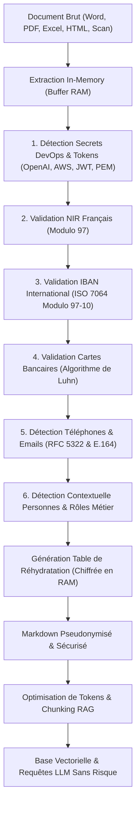
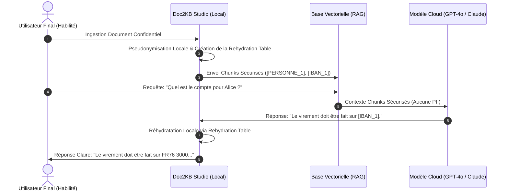

# 🛡️ Guide de l'Anonymisation des Données & Protection de la Vie Privée en Entreprise

> **Standard de référence pour l'ingestion sécurisée dans les architectures RAG & LLM — Conformité RGPD, HIPAA, PCI-DSS et FinOps IA.**

---

## 1. ⚠️ Les Risques Critiques des Données Sensibles dans les LLMs

L'intégration de corpus documentaires d'entreprise dans des pipelines RAG (*Retrieval-Augmented Generation*) ou dans le contexte direct de modèles de fondation (OpenAI GPT-4o, Anthropic Claude 3.5, Google Gemini 1.5) expose l'organisation à des vulnérabilités de premier ordre :

| Vecteur de Risque | Description de la Menace | Impact Réglementaire & Financier |
| :--- | :--- | :--- |
| **Fuite vers les fournisseurs Cloud** | Envoi involontaire de données personnelles (PII) ou bancaires dans les requêtes d'inférence. | Violation directe du RGPD (amende jusqu'à 20M€ ou 4% du CA mondial). |
| **Mémorisation dans les modèles** | Les LLMs peuvent mémoriser des chaînes rares (numéros de sécurité sociale, clés privées) lors d'un éventuel fine-tuning ou de la télémétrie. | Risque d'extraction non autorisée via des techniques de *Prompt Extraction*. |
| **Injection de Secrets DevOps** | Présence de clés d'API (AWS, GitHub, OpenAI) ou certificats privés dans la documentation interne ingérée. | Compromission intégrale de l'infrastructure cloud et mouvements latéraux d'attaquants. |
| **Fuite inter-utilisateurs en RAG** | Si un utilisateur non habilité pose une question au système RAG, le retriever peut extraire un chunk contenant le salaire ou le diagnostic d'un tiers. | Rupture de confidentialité HIPAA / secret médical / droit du travail. |

---

## 2. 🏛️ Cadre Réglementaire & Normes Internationales

Pour être déployée en environnement bancaire, médical ou corporate, une chaîne de traitement RAG doit satisfaire aux exigences suivantes :

### 2.1. RGPD (Règlement Général sur la Protection des Données)
- **Article 5 (Minimisation des données)** : Les données doivent être adéquates, pertinentes et limitées à ce qui est strictement nécessaire au regard des finalités du traitement.
- **Article 25 (Privacy by Design and by Default)** : Les mesures techniques de protection doivent être intégrées dès la conception du système d'ingestion.
- **Article 32 (Sécurité des traitements & Pseudonymisation)** : La pseudonymisation est explicitement reconnue comme mesure technique appropriée pour réduire les risques de violation de données.

### 2.2. HIPAA (Health Insurance Portability and Accountability Act)
- Méthode **Safe Harbor** (§164.514(b)(2)) : Exige l'élimination ou la substitution de 18 identifiants directs et indirects (noms, dates de naissance, numéros de téléphone, adresses IP, numéros de sécurité sociale, etc.) avant tout traitement par des agents d'IA.

### 2.3. PCI-DSS v4.0 (Payment Card Industry Data Security Standard)
- **Exigence 3** : Interdiction formelle d'exposer ou de stocker en clair le numéro de compte principal (PAN) et les codes de sécurité bancaires dans des logs, des embeddings vectoriels ou des caches LLM.

---

## 3. 🚨 Pourquoi le Caviarçage Aveugle (`[REDACTED]`) Détruit les Performances du RAG

La plupart des outils d'anonymisation basiques appliquent un masquage uniforme en remplaçant chaque valeur par `[REDACTED]`, `XXXX` ou `***`. **Cette approche est catastrophique pour les architectures IA modernes.**

### 3.1. Rupture de la Co-référence Sémantique
Prenons la phrase suivante :
> *"Le Dr. Jean Dupont a prescrit le traitement à Thomas Dubois. Après consultation, le Dr. Jean Dupont a renouvelé l'ordonnance de Thomas Dubois."*

* **Caviarçage aveugle** :
  > *"Le `[REDACTED]` a prescrit le traitement à `[REDACTED]`. Après consultation, le `[REDACTED]` a renouvelé l'ordonnance de `[REDACTED]`."*
  
  Le LLM est incapable de déterminer qui est le prescripteur, qui est le bénéficiaire, si le premier acteur est le même que le second, et les relations de causalité s'effondrent.

* **Pseudonymisation Cohérente Doc2KB Studio** :
  > *"Le Dr. `[PERSONNE_1]` a prescrit le traitement à `[PERSONNE_2]`. Après consultation, le Dr. `[PERSONNE_1]` a renouvelé l'ordonnance de `[PERSONNE_2]`."*
  
  Le LLM conserve **100% de la structure logique et relationnelle**. Il sait que `[PERSONNE_1]` est le médecin référent et que `[PERSONNE_2]` est le patient suivi.

### 3.2. Préservation de la Qualité des Plongements Vectoriels (*Embeddings*)
Un texte saturé de `[REDACTED]` identiques provoque un aplatissement de l'espace vectoriel : les chunks se ressemblent artificiellement, faussant la similarité cosinus (*Cosine Similarity*) et polluant les résultats du retrieval.

---

## 4. ⚙️ Moteurs de Détection & Validation Mathématique Locale

L'approche de **Doc2KB Studio** repose sur une exécution **100% locale en mémoire**, sans aucun appel à un service tiers (zéro fuite vers le cloud). Elle combine des expressions régulières RFC éprouvées et des **algorithmes de validation mathématique formelle (Checksums)** :



### 4.1. Algorithme de Luhn (Cartes Bancaires)
Au lieu de masquer aveuglément tout groupe de 16 chiffres (ce qui détruirait des références produits, numéros de facture ou codes-barres), Doc2KB applique l'algorithme officiel de **Luhn (ISO/IEC 7812)** :
- Calcul de la somme alternée modulo 10 en doublant un chiffre sur deux de droite à gauche.
- Seuls les numéros bancaires valides sont interceptés et remplacés par `[CB_1]`.

### 4.2. Norme ISO 7064 Modulo 97-10 (IBAN)
Les coordonnées bancaires internationales respectent une clé de contrôle stricte :
- Déplacement des 4 caractères initiaux à la fin.
- Conversion des lettres en valeurs numériques ($A=10, B=11, \dots$).
- Vérification du résidu `numeric_string % 97 === 1` via calcul sur entiers arbitraires `BigInt`.
- Garantie de **0 faux positif** sur les identifiants de compte.

### 4.3. Contrôle Modulo 97 du NIR Français (Numéro de Sécurité Sociale)
Le NIR français (13 ou 15 chiffres) est validé par sa clé de contrôle légale :
$$\text{Clé} = 97 - (\text{NIR}_{13} \pmod{97})$$
Cette validation mathématique évite d'anonymiser par erreur des numéros de série industriels ou des codes internes.

### 4.4. Détection Chirurgicale des Secrets Développeur & DevOps
- **OpenAI** : Détection des clés secrètes `sk-...` et des clés de projet modernes `sk-proj-...` avec entropie de 32+ caractères.
- **Amazon Web Services (AWS)** : Interception des identifiants IAM `AKIA[0-9A-Z]{16}`.
- **GitHub** : PAT classiques `ghp_...` et jetons fins `github_pat_...`.
- **Certificats & Cryptographie** : Clés privées PEM (`BEGIN RSA PRIVATE KEY`, `BEGIN OPENSSH PRIVATE KEY`).
- **Webhooks internes** : URLs de notifications Slack (`hooks.slack.com`) et Discord.

---

## 5. 💡 Synergie FinOps : Réduction Massive de Tokens

L'anonymisation n'est pas seulement une exigence réglementaire : c'est un **accélérateur direct de performance FinOps**. Les identifiants sensibles et les clés cryptographiques consomment un nombre disproportionné de tokens en encodage BPE (*Byte-Pair Encoding*) :

| Entité Sensible Brute | Tokens Bruts (cl100k) | Token Pseudonymisé | Économie de Tokens |
| :--- | :---: | :---: | :---: |
| `sk-proj-aB1c2D3e4F5g6H7i8J9k0L1m2N3o4P5q6R7s8T9u0V1w2X3y4Z5...` | **64 tokens** | `[API_KEY_OPENAI_1]` (**4 tokens**) | **-93.7%** |
| `FR76 3000 6000 0112 3456 7890 189` | **18 tokens** | `[IBAN_1]` (**3 tokens**) | **-83.3%** |
| `jean-francois.delatour-martinez@enterprise-consulting-group.fr` | **16 tokens** | `[EMAIL_1]` (**3 tokens**) | **-81.2%** |
| `0033 6 12 34 56 78` | **11 tokens** | `[TEL_1]` (**3 tokens**) | **-72.7%** |

> [!TIP]
> Sur un corpus d'entreprise contenant des centaines de contrats, factures et logs techniques, **la pseudonymisation réduit à elle seule entre 5% et 15% du volume global de tokens**, tout en éliminant 100% du risque de fuite.

---

## 6. 🔄 Le Cycle de Vie de la Table de Réhydratation (*Detokenization*)

Pour les cas d'usage où l'utilisateur final a le droit légitime de recevoir une réponse personnalisée (ex: Service Client, RH interne) :



1. **Isolation stricte** : La table de réhydratation (`rehydrationMap`) reste cantonnée sur la machine hôte ou le serveur local de l'entreprise.
2. **Zéro persistance** : La table peut être conservée uniquement dans la session éphémère de l'utilisateur ou chiffrée avec une clé AES-256 locale.
3. **Ségrégation des privilèges** : Seuls les utilisateurs disposant du rôle RBAC adéquat voient la réponse réhydratée.

---

## 7. 💻 Utilisation Programmatique

### 7.1. Intégration via le SDK Node.js Local
```javascript
const { anonymizeText } = require('./lib/anonymizer');

const inputMarkdown = `
Contrat signé entre Dr. Jean Dupont et Marie Martin.
Contact: jean.dupont@corp.fr / +33 1 42 68 00 00
Compte de règlement: FR76 3000 6000 0112 3456 7890 189
Clé API provisionnée: sk-proj-1234567890abcdef1234567890abcdef1234567890abcdef
`;

const result = anonymizeText(inputMarkdown, {
  mode: 'pseudonymize', // 'pseudonymize' | 'mask' | 'redact'
  maskEmails: true,
  maskPhones: true,
  maskCards: true,
  maskIbans: true,
  maskNir: true,
  maskSecrets: true,
  maskNames: true
});

console.log(result.anonymizedText);
/*
Contrat signé entre Dr. [PERSONNE_1] et [PERSONNE_2].
Contact: [EMAIL_1] / [TEL_1]
Compte de règlement: [IBAN_1]
Clé API provisionnée: [API_KEY_OPENAI_1]
*/

console.log(result.stats);
// { total: 5, byType: { person_name: 2, email: 1, phone_fr: 1, iban: 1, api_key_openai: 1 } }

console.log(result.rehydrationMap);
// { '[PERSONNE_1]': 'Jean Dupont', '[IBAN_1]': 'FR76 3000 6000 0112 3456 7890 189', ... }
```

### 7.2. Appel via l'API REST
```bash
curl -X POST http://localhost:3000/api/optimize-text \
  -H "Content-Type: application/json" \
  -d '{
    "text": "Facture émise pour M. Jean Dupont (jean.dupont@test.com). Compte: FR76 3000 6000 0112 3456 7890 189",
    "level": "clean",
    "anonymize": true,
    "anonymizeMode": "pseudonymize"
  }'
```

---

## 8. ✅ Checklist d'Audit pour les Responsables Sécurité & DPO

Avant d'ouvrir une base de connaissances documentaire aux modèles LLM, vérifiez les points suivants :

- [x] **Traitement 100% Hors-Ligne** : Aucun texte brut n'est transmis à un service d'anonymisation tiers sur le cloud public.
- [x] **Validation Mathématique** : Les numéros bancaires et de sécurité sociale font l'objet de calculs de checksums (Luhn, Modulo 97) pour éviter faux positifs et faux négatifs.
- [x] **Pseudonymisation Réversible Locale** : Les identités conservent leurs alias (`[PERSONNE_1]`) pour préserver les co-références logiques en RAG.
- [x] **Éradication des Secrets DevOps** : Clés d'API, jetons JWT et certificats PEM sont neutralisés avant toute vectorisation.
- [x] **Traçabilité & Métadonnées** : Les statistiques d'anonymisation sont consignées dans `manifest.json` pour validation de conformité lors d'un audit RGPD.
